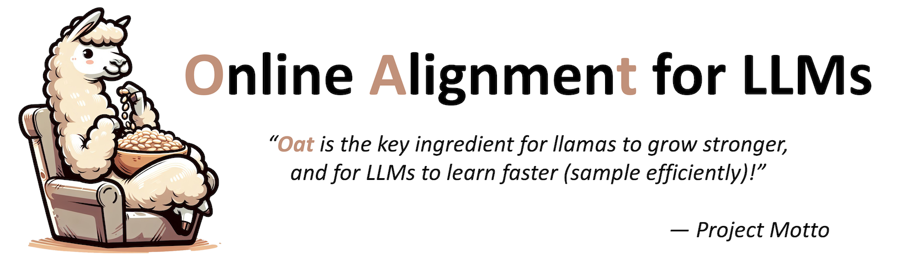
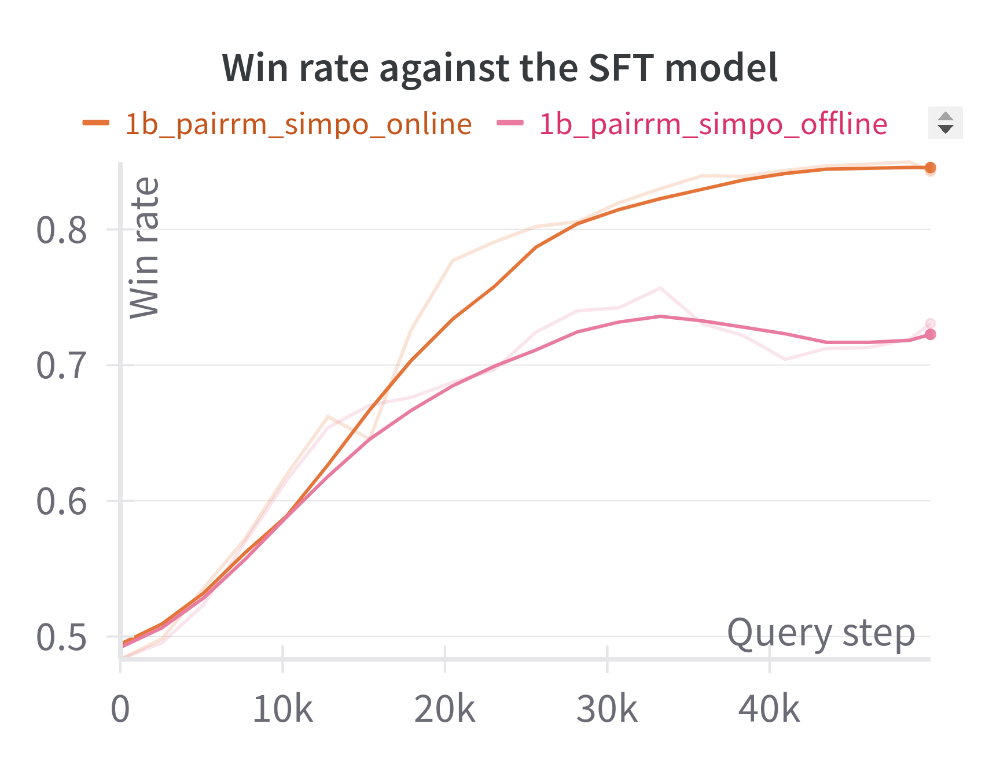
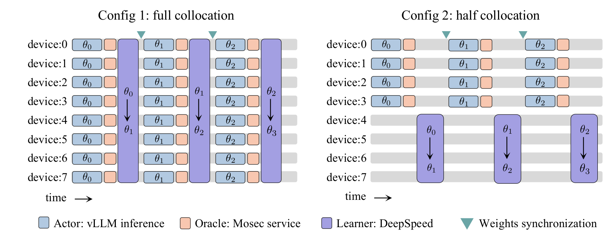
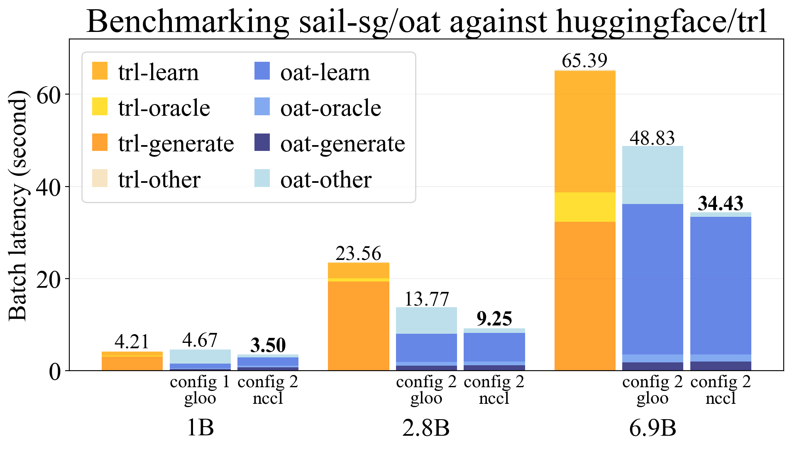

<p align="center">
  
</p>

[](https://pypi.org/project/oat-llm)
[](https://pypi.org/project/oat-llm)

## Introduction
Oat 🌾 is a simple yet efficient system for training online LLM alignment algorithms. Key features include:

* **High Efficiency**: Oat implements a distributed *Actor-Learner-Oracle* architecture, with each component being optimized using state-of-the-art tools:
  * `Actor`: Powered by [vLLM](https://github.com/vllm-project/vllm) for accelerated online response sampling.
  * `Learner`: Enhanced by [DeepSpeed](https://github.com/microsoft/DeepSpeed) ZeRO strategies to maximize memory efficiency.
  * `Oracle`: Hosted by [Mosec](https://github.com/mosecorg/mosec) as a remote service, supporting dynamic batching, data parallelism and pipeline parallelism.
* **Simplification**: Oat simplifies the experimental pipeline of LLM alignment. With an `Oracle` served online, we can flexibly query it for preference data labeling as well as anytime model evaluation. All you need is to launch experiments and monitor real-time learning curves (e.g., win rate) on [wandb](https://wandb.ai/lkevinzc/oat-llm) — no need for manual training, checkpointing and loading for evaluation.
* **Oracle Simulation**: Oat provides simulated preference oracles in various modes. Lightweight reward models run within the same process, while larger models are served remotely. Additionally, you can query GPT online to leverage LLM-as-a-judge as the oracle.
* **Ease of Use**: With a modular design, oat allows researchers to inherit and modify existing classes effortlessly, enabling rapid algorithm development and testing.
* **Cutting-Edge Algorithms**: Oat implements state-of-the-art LLM exploration (active alignment) algorithms, including SEA, APL and XPO, along with popular direct optimizers such as DPO and SimPO, fostering innovation and fair benchmarking.

## Installation :wrench:
In a python environment (`>=3.8, <=3.10`), you can install oat via PyPI:
```console
pip install vllm==0.6.2 && pip install oat-llm
```
Or you could also install in "editable" mode for local development:
```console
git clone git@github.com:sail-sg/oat.git
cd oat
pip install vllm==0.6.2 && pip install -e .
```

## Usage
Below is an example to align a 1-B Pythia Model on the tl;dr dataset using online SimPO with PairRM as the preference oracle:
```console
python -m oat.experiment.main \
    --total_gpus 2 \
    --collocate \
    --dap_algo SimPO \
    --reward_oracle pairrm \
    --pretrain trl-lib/pythia-1b-deduped-tldr-sft \
    --prompt_data lkevinzc/tldr-with-sft-reference \
    --sync_params_every 1 \
    --train_batch_size 128 \
    --rollout_batch_size 128 \
    --micro_rollout_batch_size 64 \
    --micro_pi_buffer_maxlen 64 \
    --micro_train_batch_size 8 \
    --use_wandb True \
    --wandb_run_name 1b_pairrm_dpo_online
```
This example completes in less than two hours on two A100 GPUs! To run an offline SimPO for comparison, set `--sync_params_every` to a large number, disabling policy learner weights synchronization. 

<p align="center">
  
</p>

More examples can be found [here](./examples/). 

## Benchmarking
Our system benchmarking compares oat with the online DPO implementation from [huggingface/trl](https://huggingface.co/docs/trl/main/en/online_dpo_trainer). We use the following configurations for oat, and show the benchmarking results below.

<p align="center">
  
</p>

<p align="center">
  
</p>

Please refer to the Appendix C of our paper for detailed benchmarking methods and discussion on the results.

## License

`oat` is distributed under the terms of the [Apache2](https://www.apache.org/licenses/LICENSE-2.0) license.

## Acknowledgement
We thank the following awesome projects which oat benefits from:
* [vLLM](https://github.com/vllm-project/vllm)
* [DeepSpeed](https://github.com/microsoft/DeepSpeed)
* [Mosec](https://github.com/mosecorg/mosec)
* [OpenRLHF](https://github.com/OpenRLHF/OpenRLHF)

## Disclaimer

This is not an official Sea Limited or Garena Online Private Limited product.